# Configuração das Coordenadas

Este documento apresenta as coordenadas utilizadas pelo `QuadroCurricularController`
para realizar a automação do sistema.

Cada parâmetro possui uma posição `x`, `y` e uma cor de referência utilizada
pela automação.

---

## `turma_stado`

> Imagem da coordenada:

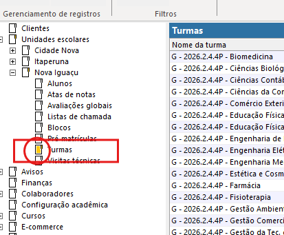

---

## `stado_dados_turma`

> Imagem da coordenada:

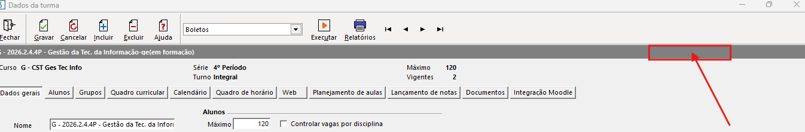

---

## `aba_quadro_curricular`

> Imagem da coordenada:

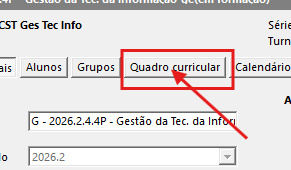

---

## `input_prof_1 & input_prof_2`

> Imagem da coordenada:

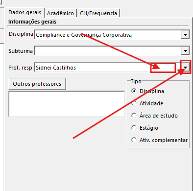

---

## `btn_proximo`

> Imagem da coordenada:

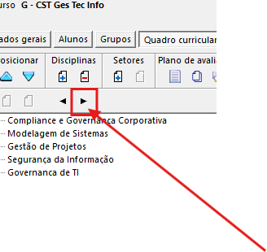

---

## `aba_dados_gerais`

> Imagem da coordenada:

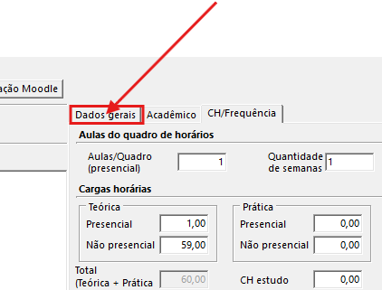

---

## `a_quadro & q_semana`

> Imagem da coordenada:

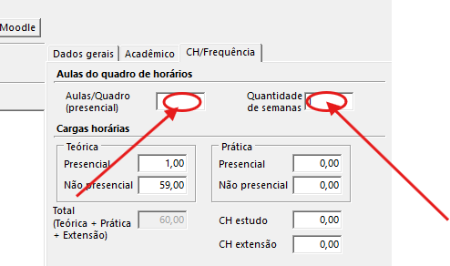

---

## `warning & ok_warning`

> Imagem da coordenada:

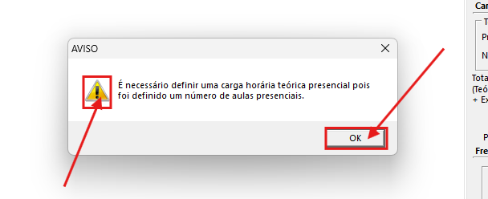

---

## `campo_list_turmas`

> Imagem da coordenada:

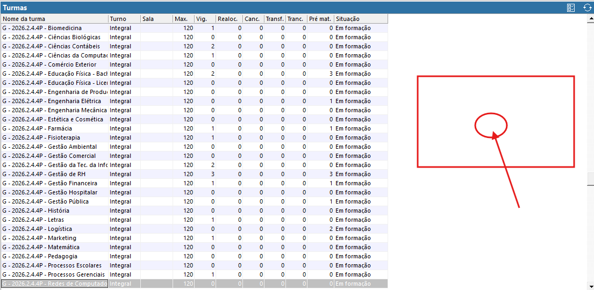

---

## `salvar_dados_turma`

> Imagem da coordenada:

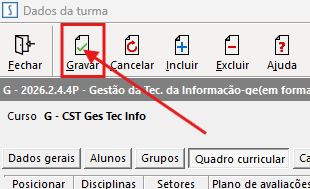

---

## `fechar_dados_turma`

> Imagem da coordenada:

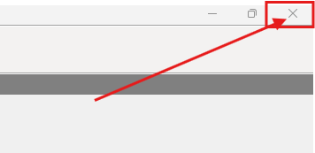

---

## `fechar_dados_turma_confirm1`

> Imagem da coordenada:

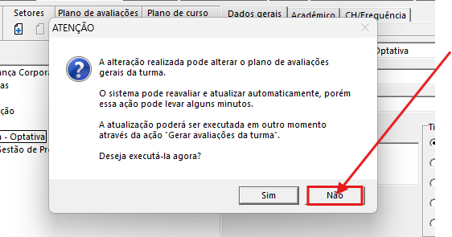

---

## `fechar_dados_turma_confirm2`

> Imagem da coordenada:

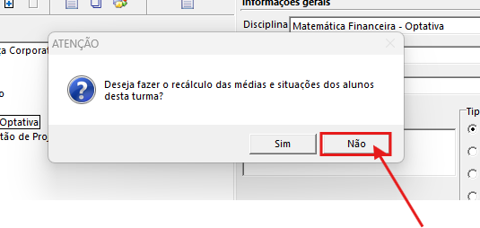
